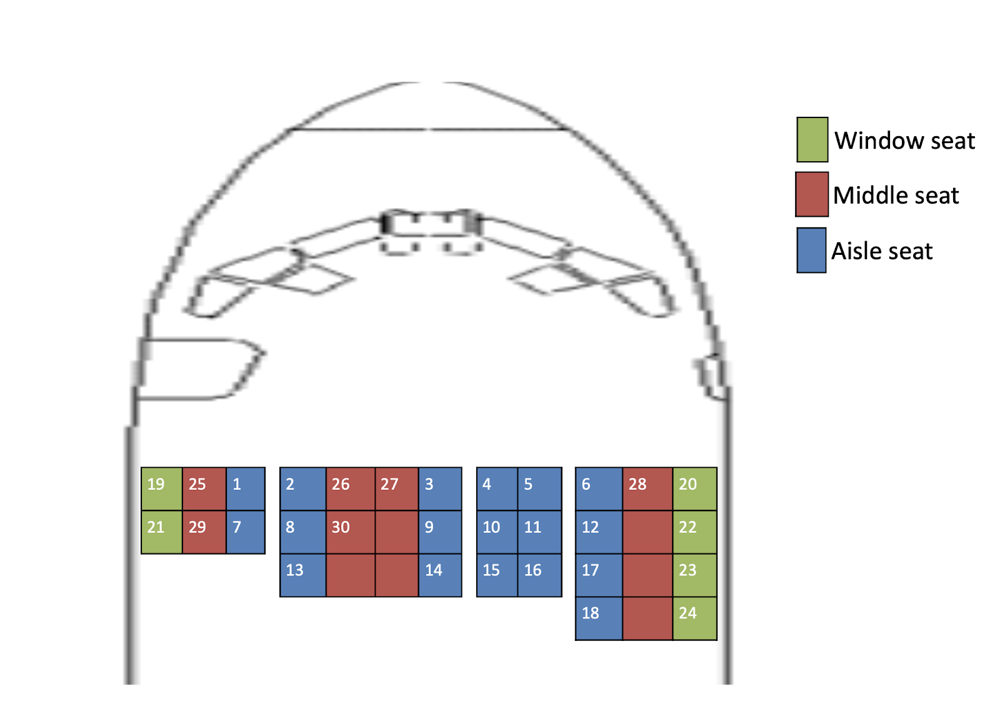

# Run app

## Create project folder

  $ mkdir your_folder_name

## Go to your project folder

  $ cd your_folder_name

## Clone project

## Build docker

  $ MSYS_NO_PATHCONV=1 docker run -v "${PWD}/app:/app" -it -w /app ruby:3.0 bash
  
## Install dependencies

  $ bundle install
  
## Run

  $ ruby app.rb

## About the app

* Accepts a 2D array and a numeric value which corresponds to the seat setup of an airplane and the number of passengers respectively.

* There are three types of seats: Aisle, Middle, Window.
* Rules for seating
  1. Always seat passengers starting from the front row to back, starting from the left to the right
  2. Fill aisle seats first followed by window seats followed by center seats (any order in center seats)

## Example

<!--  -->